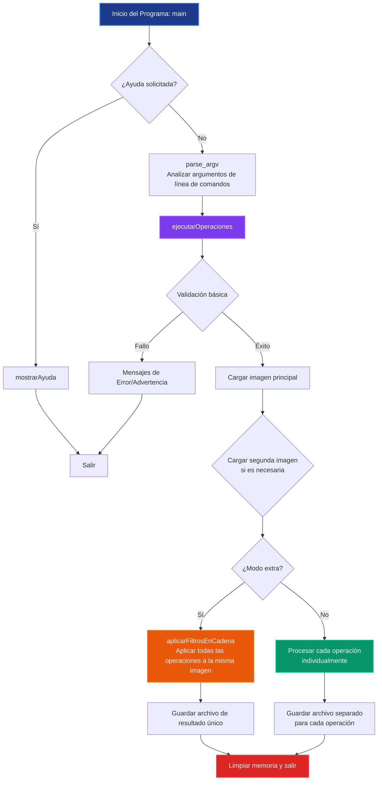
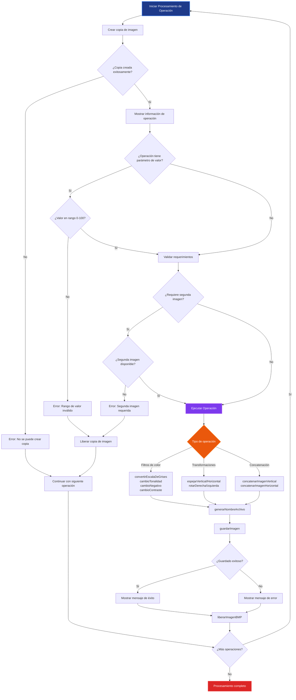

# BMP Manipulator - Grupo LUMEN

## Descripción

BMP Manipulator es una herramienta de línea de comandos desarrollada en C para modificar imágenes en formato BMP. Permite aplicar múltiples filtros y transformaciones a las imágenes, generando archivos de salida separados para cada operación.

## Características

- **Múltiples operaciones en una sola ejecución**: Aplica varios filtros simultáneamente
- **Archivos de salida independientes**: Cada operación genera su propio archivo
- **Manejo robusto de errores**: Continúa procesando aunque una operación falle
- **Detección de argumentos duplicados**: Evita procesar la misma operación múltiples veces
- **Soporte para valores personalizados**: Permite ajustar parámetros de los filtros

## Instalación y Compilación

### Prerrequisitos
- GCC (GNU Compiler Collection)
- Git Bash o terminal compatible con bash (para usar el script de compilación)
- Code::Blocks IDE (opcional, para desarrollo en entorno gráfico)

### Compilación

#### Opción 1: Script de Bash (Recomendado)
```bash
# Compilar solamente
./build.sh

# Compilar y ejecutar
./build.sh run

# Compilar y ejecutar con argumentos
./build.sh run imagen.bmp --escala-de-grises --tonalidad-azul=5

# ¿Necesitas ayuda?
./build.sh run --help
```

#### Opción 2: Code::Blocks IDE
```
1. Abrir el proyecto: bmp_manipulaitor.cbp
2. Configurar el compilador: Build → Compiler settings → GNU GCC Compiler
3. Configurar argumentos del programa: Project → Set programs' arguments...
   - En "Program arguments" ingresar (ejemplo): imagen.bmp --escala-de-grises --tonalidad-azul=5
4. Compilar y ejecutar: Build → Build and run (F9)

Nota: Es necesario ajustar manualmente los argumentos en "Program arguments" 
cada vez que quieras probar diferentes operaciones.
```

#### Opción 3: Compilación Manual
```bash
gcc -Wall -Wextra -std=c99 -g funciones_grupo.c funciones_zapata.c funciones_quiroga.c lib/TDAImagenBMP.c -o bin/bmp_manipuleitor.exe -lm
```

## Enunciado del Trabajo Práctico

Se solicita realizar un programa en lenguaje C llamado **bmpmanipuleitor**, que a partir de un archivo BMP de 24 bits de profundidad genere otro archivo BMP con las modificaciones solicitadas como argumentos a main.

**Ejemplo básico:**
```bash
bmp_manipuleitor.exe --negativo imagenOriginal.bmp
```
Debe generar un archivo llamado `LUMEN_negativo_imagenOriginal.bmp` que contenga la misma imagen, pero con los colores invertidos.

## Uso

### Sintaxis Básica
```
bmp_manipuleitor.exe <imagen_entrada> [imagen_adicional] [opciones]
```

### Parámetros
- `imagen_entrada`: Archivo BMP de entrada (requerido)
- `imagen_adicional`: Segunda imagen BMP para operaciones de concatenación (opcional)
- `opciones`: Una o más operaciones a aplicar

### Operaciones Disponibles

#### Operaciones Simples
| Operación | Descripción |
|-----------|-------------|
| `--escala-de-grises` | Promedia los valores RGB y los transforma a gris |
| `--negativo` | Invierte los colores de la imagen |
| `--rotar-derecha` | Gira la imagen 90° a la derecha (sentido horario) |
| `--rotar-izquierda` | Gira la imagen 90° a la izquierda (sentido antihorario) |
| `--espejar-horizontal` | Invierte horizontalmente la imagen |
| `--espejar-vertical` | Invierte verticalmente la imagen |

#### Operaciones con Valores (0-100%)
| Operación | Sintaxis | Valor por Defecto | Descripción |
|-----------|----------|-------------------|-------------|
| `--tonalidad-azul` | `--tonalidad-azul[=valor]` | 10 | Aumenta la intensidad del color azul (%) |
| `--tonalidad-roja` | `--tonalidad-roja[=valor]` | 10 | Aumenta la intensidad del color rojo (%) |
| `--tonalidad-verde` | `--tonalidad-verde[=valor]` | 10 | Aumenta la intensidad del color verde (%) |
| `--aumentar-contraste` | `--aumentar-contraste[=valor]` | 20 | Aumenta el contraste (%) |
| `--reducir-contraste` | `--reducir-contraste[=valor]` | 20 | Reduce el contraste (%) |
| `--recortar` | `--recortar[=valor]` | 10 | Reduce el tamaño sin cambiar proporciones, descarta excedente (%) |
| `--achicar` | `--achicar[=factor]` | 10 | Reescala la imagen completa a menor tamaño (%) |

**Nota sobre recortar vs achicar:**
- `--recortar=30`: En una imagen 1000×500px, mantiene píxeles entre 0-299 (X) y 0-149 (Y)
- `--achicar=10`: En una imagen 1000×500px, reescala toda la imagen a 100×50px

#### Operaciones de Concatenación
| Operación | Descripción |
|-----------|-------------|
| `--concatenar-horizontal` | Une dos imágenes lado a lado. Si tienen diferente alto, rellena con color verde |
| `--concatenar-vertical` | Une dos imágenes arriba-abajo. Si tienen diferente ancho, rellena con color verde |

#### Funcionalidad Especial
| Operación | Descripción |
|-----------|-------------|
| `--comodin` | Aplica todas las operaciones especificadas en cadena sobre la misma imagen |

### Archivos de Salida

Los archivos de salida siguen el formato:
```
LUMEN_<operacion>_<nombre_imagen>.bmp
```

## Ejemplos de Uso

### Ejemplo 1: Operación simple
```bash
bmp_manipuleitor.exe --negativo imagenOriginal.bmp
```
**Genera:**
- `LUMEN_negativo_imagenOriginal.bmp`

### Ejemplo 2: Operaciones múltiples
```bash
bmp_manipuleitor.exe unlam.bmp --negativo --escala-de-grises
```
**Genera:**
- `LUMEN_negativo_unlam.bmp`
- `LUMEN_escala-de-grises_unlam.bmp`

### Ejemplo 3: Operaciones con valores personalizados
```bash
bmp_manipuleitor.exe imagen.bmp --aumentar-contraste=18 --tonalidad-azul=5
```
**Genera:**
- `LUMEN_aumentar-contraste_imagen.bmp`
- `LUMEN_tonalidad-azul_imagen.bmp`

### Ejemplo 4: Concatenación de imágenes
```bash
bmp_manipuleitor.exe img1.bmp img2.bmp --concatenar-vertical
```
**Genera:**
- `LUMEN_concatenar-vertical_img1.bmp`

### Ejemplo 5: Comando complejo con argumentos incorrectos
```bash
bmp_manipuleitor.exe unlam.bmp --negativo --escala-de-grises --argumento-incorrecto --aumentar-contraste=18 --negativo
```
**Comportamiento:**
- Ignora `--argumento-incorrecto` con advertencia en consola
- Ignora el segundo `--negativo` (duplicado)
- **Genera:**
  - `LUMEN_negativo_unlam.bmp`
  - `LUMEN_escala-de-grises_unlam.bmp`
  - `LUMEN_aumentar-contraste_unlam.bmp`

### Ejemplo 6: Funcionalidad extra
```bash
bmp_manipuleitor.exe imagen.bmp --comodin --tonalidad-roja=40 --tonalidad-azul=40 --rotar-derecha
```
**Genera:**
- `LUMEN_comodin_imagen.bmp` (con todos los filtros aplicados en cadena)

## Comportamiento del Sistema

### Manejo de Errores
- **Argumentos incorrectos**: Se ignoran con advertencia en consola, no abortan la ejecución
- **Operaciones duplicadas**: Solo se ejecuta la primera ocurrencia
- **Archivos no encontrados**: Se reporta el error y continúa con otras operaciones
- **Parámetros fuera de rango**: Deben estar entre 0-100%, se valida y reporta error
- **Concatenación con una sola imagen**: Se reporta error específico
- **Operaciones que fallan**: Se reporta el error y continúa con las siguientes

### Características Especiales
- **Múltiples operaciones**: Se pueden ejecutar varias modificaciones en un solo llamado
- **Archivos independientes**: Cada operación genera su propio archivo de salida
- **Modo extra**: Con `--comodin`, todas las operaciones se aplican secuencialmente a la misma imagen
- **Relleno inteligente**: En concatenaciones, se usa color verde para rellenar diferencias de tamaño

### Limitaciones
- Máximo 16 operaciones por ejecución
- Máximo 2 archivos de imagen de entrada
- Solo soporta formato BMP de 24 bits de profundidad
- Las operaciones de concatenación requieren exactamente 2 imágenes
- Valores de porcentaje limitados al rango 0-100%

## Estructura del Proyecto
```
BMPmanipuleitor/
├── funciones_grupo.c      # Lógica principal y ejecución de operaciones
├── funciones_grupo.h      # Definiciones y estructuras principales
├── funciones_zapata.c     # Funciones del alumno
├── funciones_zapata.h     # Headers del alumno
├── funciones_quiroga.c    # Funciones del alumno
├── funciones_quiroga.h    # Headers del alumno
├── funciones_lazaro.c     # Funciones del alumno
├── funciones_lazaro.h     # Headers del alumno
├── build.sh               # Script de compilación
├── README.md              # Este archivo
├── bin/                   # Ejecutables compilados
├── lib/                   # Librería TDAImagenBMP
└── resources/             # Imágenes de ejemplo
```

Tomamos la decisión de separar el manejo del TDAImagenBMP en un directorio `lib/` para mantener el código organizado y facilitar su implementación en las funciones de cada alumno, es una capa de abstracción que nos permite trabajar con las imágenes sin preocuparnos por las complejidades del formato. La librería `TDAImagenBMP` se encarga de las operaciones básicas de lectura y reserva de memoria, tanto para las estructuras como para la matriz de pixeles y su posterior liberación.

## Diagrama de Flujo del Programa

### 1. Flujo General del Programa

Vista de alto nivel del camino principal de ejecución:



### 2. Lógica de Procesamiento de Operaciones

Flujo detallado para el procesamiento de operaciones individuales:



## 👥 Autores

**Grupo LUMEN**
- Tópicos de Programación - Universidad Nacional de La Matanza
- Año: 2025

- Este proyecto fue desarrollado como trabajo práctico académico para la materia Tópicos de Programación de la Universidad Nacional de La Matanza.
---
